# Handoff Guide 2: Multi-Model (11-Problem) BlendRL Training & Deployment Pipeline

## Executive Summary
This document provides the complete technical specification to train **11 separate, specialized BlendRL models** in `/Users/cameronegbert/Research/NeSyRL` (1 problem-level model + 10 exercise-level step models) and export them as drop-in replacements into `Pyrenees-python/app/models/policies/Blend-RL/`.

---

## 1. Problem Partition Matrix

| Dataset Target | Source CSV File | Input Dims | Discrete Actions | Role in Pyrenees ITS |
| :--- | :--- | :---: | :---: | :--- |
| **`problem`** | `problem.csv` | **130** | **3** (`0: PS`, `1: WE`, `2: FWE`) | **Problem-Level Policy**: Chooses problem mode (`'problem'`, `'example'`, `'step_decision'`) |
| **`ex132(w)`** | `ex132(w).csv` | **123** | **2** (`0: PS`, `1: WE`) | **Step-Level Policy** for Exercise 132 |
| **`ex132a(w)`** | `ex132a(w).csv` | **123** | **2** (`0: PS`, `1: WE`) | **Step-Level Policy** for Exercise 132a |
| **`ex152a(w)`** | `ex152a(w).csv` | **123** | **2** (`0: PS`, `1: WE`) | **Step-Level Policy** for Exercise 152a |
| **`ex212(w)`** | `ex212(w).csv` | **123** | **2** (`0: PS`, `1: WE`) | **Step-Level Policy** for Exercise 212 |
| **`ex242(w)`** | `ex242(w).csv` | **123** | **2** (`0: PS`, `1: WE`) | **Step-Level Policy** for Exercise 242 |
| **`ex252(w)`** | `ex252(w).csv` | **123** | **2** (`0: PS`, `1: WE`) | **Step-Level Policy** for Exercise 252 |
| **`ex252a(w)`** | `ex252a(w).csv` | **123** | **2** (`0: PS`, `1: WE`) | **Step-Level Policy** for Exercise 252a |
| **`exc137(w)`** | `exc137(w).csv` | **123** | **2** (`0: PS`, `1: WE`) | **Step-Level Policy** for Exercise c137 |
| **`exp426d(w)`** | `exp426d(w).csv` | **123** | **2** (`0: PS`, `1: WE`) | **Step-Level Policy** for Exercise p426d |
| **`exp426e(w)`** | `exp426e(w).csv` | **123** | **2** (`0: PS`, `1: WE`) | **Step-Level Policy** for Exercise p426e |

---

## 2. Pipeline Execution Steps

```mermaid
graph TD
    subgraph Step1 ["1. Preprocessing (NeSyRL)"]
        CSVS["Pyrenees data clean/*.csv (11 CSVs)"]
        PREP_SCRIPT["scripts/preprocess_pyrenees_per_problem.py"]
        CSVS --> PREP_SCRIPT
        PREP_SCRIPT --> PER_PROB["in/datasets/pyrenees/per_problem/{problem_id}/ (11 dataset dirs)"]
    end

    subgraph Step2 ["2. Multi-Model Training (NeSyRL)"]
        TRAIN_SCRIPT["scripts/train_pyrenees_all_problems.py"]
        PER_PROB --> TRAIN_SCRIPT
        TRAIN_SCRIPT --> CKPTS["results/checkpoints/pyrenees/per_problem/{problem_id}/best_model.ckpt"]
    end

    subgraph Step3 ["3. Batch Export to Pyrenees ITS"]
        EXP_SCRIPT["scripts/export_pyrenees_per_problem.py"]
        CKPTS --> EXP_SCRIPT
        EXP_SCRIPT --> APP_DIR["Pyrenees-python/app/models/policies/Blend-RL/"]
        APP_DIR --> TRACE["trace/{problem_id}.pt (11 models)"]
        APP_DIR --> MINMAX["minmax/{problem_id}_0.pkl (11 scalers)"]
    end

    subgraph Step4 ["4. Verification"]
        APP_DIR --> UNIT_TEST["python -m unittest app/blendrl_policy_test.py"]
    end
```



---

## 3. Implementation Blueprint

### Script 1: Dataset Partitioning
Create [`/Users/cameronegbert/Research/NeSyRL/scripts/preprocess_pyrenees_per_problem.py`](file:///Users/cameronegbert/Research/NeSyRL/scripts/preprocess_pyrenees_per_problem.py):
- Iterates over each CSV in `in/datasets/pyrenees/Pyrenees data clean/`.
- For `problem.csv`:
  - Extracts 130 state features, actions `0, 1, 2`.
  - Fits dedicated scaler and GMM competency components.
- For each exercise CSV (`ex132(w).csv`, etc.):
  - Extracts 123 state features, actions `0, 1`.
  - Fits dedicated scaler and GMM competency components.
- Saves each problem dataset to `in/datasets/pyrenees/per_problem/{problem_id}/`:
  - `clean.npz` (contains `states`, `actions`, `rewards`, `next_states`, `dones`, `terminals`)
  - `scaler.npz` (contains `mean`, `std`, `min`, `max`)
  - `gmm_scaler.npz` (contains GMM means, precisions, weights)

### Script 2: Multi-Model Training Orchestrator
Create [`/Users/cameronegbert/Research/NeSyRL/scripts/train_pyrenees_all_problems.py`](file:///Users/cameronegbert/Research/NeSyRL/scripts/train_pyrenees_all_problems.py):
- Iterates through all 11 problem types.
- Configures:
  - `num_in_features`: 130 for `problem`, 123 for exercises.
  - `n_actions`: 3 for `problem`, 2 for exercises.
- Launches `train_offline` with `CQLAgent`, `BlenderActorCritic`, and `NSFR` module.
- Saves 11 checkpoints to `results/checkpoints/pyrenees/per_problem/{problem_id}/best_model.ckpt`.

### Script 3: Batch Export to Pyrenees ITS
Create [`/Users/cameronegbert/Research/NeSyRL/scripts/export_pyrenees_per_problem.py`](file:///Users/cameronegbert/Research/NeSyRL/scripts/export_pyrenees_per_problem.py):
- Iterates over all 11 trained checkpoints.
- For each problem:
  - Loads `best_model.ckpt`.
  - Compiles TorchScript traced model `torch.jit.trace`.
  - Saves `{problem_id}.pt` to `Pyrenees-python/app/models/policies/Blend-RL/trace/`.
  - Saves `{problem_id}_0.pkl` with `MinMaxScaler` data to `Pyrenees-python/app/models/policies/Blend-RL/minmax/`.
- Acts as a **100% transparent drop-in replacement**: replaces the Phase 1 placeholder models with zero code changes required in `Pyrenees-python`.

---

## 4. Verification & Execution Commands

```bash
# 1. Run Per-Problem Preprocessing in NeSyRL
/Users/cameronegbert/Research/NeSyRL/venv/bin/python /Users/cameronegbert/Research/NeSyRL/scripts/preprocess_pyrenees_per_problem.py

# 2. Run Multi-Problem Training
/Users/cameronegbert/Research/NeSyRL/venv/bin/python /Users/cameronegbert/Research/NeSyRL/scripts/train_pyrenees_all_problems.py

# 3. Batch Export all 11 Models to Pyrenees ITS
/Users/cameronegbert/Research/NeSyRL/venv/bin/python /Users/cameronegbert/Research/NeSyRL/scripts/export_pyrenees_per_problem.py

# 4. Verify in Pyrenees ITS
cd /Users/cameronegbert/Research/Pyrenees/Pyrenees-python
python -m unittest app/blendrl_policy_test.py
./run_all_unit_tests.sh
```

---

## 5. Fresh Context Prompt
When opening a clean chat to execute this multi-model training pipeline, paste:
```text
Please execute Handoff Guide 2 (Multi-Model BlendRL Training & Deployment Pipeline) documented in handoff_multimodel_training_pipeline.md:
1. Create and run scripts/preprocess_pyrenees_per_problem.py in NeSyRL
2. Create and run scripts/train_pyrenees_all_problems.py to train all 11 problem models
3. Create and run scripts/export_pyrenees_per_problem.py to update app/models/policies/Blend-RL/
4. Run app/blendrl_policy_test.py and ./run_all_unit_tests.sh to verify all 11 specialized models.
```
